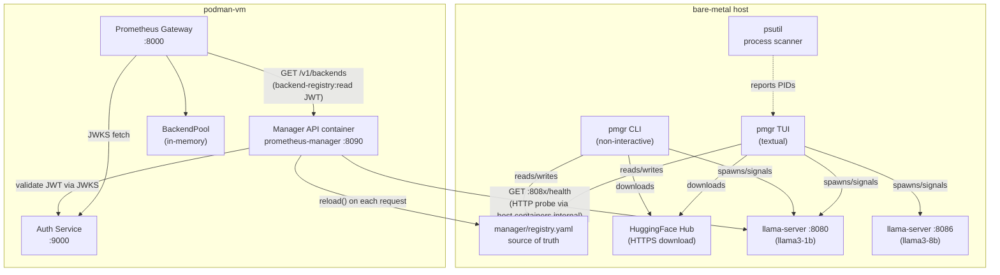

# 008 — llama-server Manager CLI & Backend Registry API

## Problem Statement

llama-server instances on the bare-metal host are currently managed through a collection of
disconnected shell scripts (`start-server.sh`, `install-server.sh`, `download-model.sh`) and
hand-edited `.env` files. Additionally, the model registry (`runtime/models/registry.yaml`) is
a flat file that the gateway reads at startup — making it the gateway's responsibility to know
about available backends. This approach has several operational and architectural gaps:

1. **No visibility**: there is no single command to see which llama-server processes are running,
   on which ports, or what their current CPU/RAM usage is.
2. **No lifecycle management**: starting, stopping, or restarting an instance requires knowing
   the correct env file, sourcing it, and running the right script by hand — error-prone and
   undocumented for new operators.
3. **Wrong ownership of the registry**: the gateway should not own the model registry — it is
   the manager (bare-metal layer) that knows which models are available and running. The current
   design leaks infrastructure concerns into the gateway.
4. **No model acquisition**: operators must download GGUF weights manually from HuggingFace and
   track them outside the platform, with no visibility into download progress or storage state.
5. **No programmatic interface**: automation, CI/CD pipelines, or future orchestration tooling
   cannot safely start/stop models without shelling out to ad-hoc scripts.
6. **Process orphans**: if llama-server is started outside the normal scripts (e.g. manually
   during debugging), the manager has no way to detect or associate those processes with registry
   entries.

Without a unified manager the platform is operationally fragile and cannot scale to multiple
model instances running concurrently on the same host.

## Goals

- [ ] Provide a Python CLI application (`pmgr`) with a user-friendly **`textual` TUI** that
      always fills 100% of the terminal regardless of size (responsive layout via Textual CSS).
- [ ] TUI has five views switchable via tab bar: **Dashboard** (summary), **Instances**,
      **Registry**, **Downloads**, **Discovery**.
- [ ] Dashboard view: host resource gauges (CPU%, RAM%, GPU VRAM% if available), summary
      counts (running / stopped / downloading), and a compact instance list.
- [ ] Instances view: full table with sparkline CPU/RAM graphs per instance, GPU% per instance
      (if GPU present), and inline lifecycle action buttons.
- [ ] Downloads view: queue and track HuggingFace GGUF downloads with progress bars.
- [ ] Registry panel: browse and manage registered models with keyboard-driven actions.
- [ ] Transfer registry ownership to the manager: `runtime/manager/registry.yaml` is the single
      source of truth. The gateway no longer reads a static YAML file — it queries the Manager
      API.
- [ ] Expose a **Manager REST API** (`:8090` on bare-metal) that the gateway polls to discover
      available backends and their live state.
- [ ] Gateway authenticates to the Manager API using an RS256 JWT with scope
      `backend-registry:read`, issued by the existing auth-service.
- [ ] Manager validates inbound JWTs using the JWKS endpoint of the existing auth-service —
      reusing all existing auth infrastructure.
- [ ] Allow operators to add and remove model entries from the registry via the TUI and CLI.
- [ ] Download GGUF model weights from HuggingFace Hub directly from the TUI/CLI with
      progress tracking and SHA-256 verification.
- [ ] Host resource panel shows: total CPU% (per-core bars), RAM used/total, GPU VRAM
      used/total and GPU% if a CUDA or Metal GPU is detected via `gputil`/`pynvml` (macOS
      reads from `psutil` + IOKit data; gracefully absent if no GPU detected).
- [ ] Each running instance row shows a 10-sample sparkline for CPU% and RAM over the last
      20 s, plus a GPU% column (if GPU present).
- [ ] Instance lifecycle actions available from the TUI and CLI: **start**, **stop**,
      **restart**, **pause** (SIGSTOP), **resume** (SIGCONT), **deregister** (stop + remove
      from registry).
- [ ] Capacity warning system: before launching a new instance, the manager estimates the
      memory footprint from the registry `rss_estimate_mb` field (or heuristic: model file
      size × 1.2). If total estimated RAM of all running + requested instances exceeds 85% of
      host RAM, a yellow warning dialog is shown. Above 95%, a red blocking alert is shown
      and launch is aborted unless the operator confirms override.
- [ ] Detect llama-server processes not started by the manager via `psutil` (attach/detect mode).
- [ ] Integrate as a new `uv` workspace member (`runtime/manager/`) with its own `pyproject.toml`.
- [ ] All **llama-server instances** spawned by the manager are ALWAYS bound to `127.0.0.1` only — never to `0.0.0.0`. This is the security boundary: llama-server is only reachable from the host machine.
- [ ] The **Manager REST API** binds to `0.0.0.0` by default (configurable via `[api] host` in `manager.toml`) so that containerised services (e.g. the gateway running in Podman) can reach it via `host.containers.internal:8090`.

## Non-Goals

- No graphical (GUI) interface — `textual` TUI only.
- No remote management — `pmgr` TUI runs on the same bare-metal host as llama-server.
- No Podman/Docker containerisation of llama-server — runs bare-metal by design.
- **`pmgr serve` (Manager REST API) does run in a container** — see `runtime/manager/Dockerfile`.
- No llama.cpp build / installation management — that remains `install-server.sh`.
- No Windows or Linux systemd unit generation in this spec (may be addressed in a later spec).
- No multi-host management.
- Manager does NOT call the gateway (architectural inversion complete — gateway calls manager).

## Proposed Solution

`prometheus-manager` (invoked as `pmgr`) is a Python application with three modes of operation:

1. **Interactive TUI** (`pmgr` or `pmgr dashboard`) — a `textual`-powered full-screen terminal
   application running on bare-metal. Manages lifecycle, modifies `registry.yaml`.
2. **Non-interactive CLI** (`pmgr status`, `pmgr start <id>`, etc.) — for scripting and CI pipelines.
3. **REST API** (`pmgr serve` / container `prometheus-manager:latest`) — a FastAPI HTTP server on
   `:8090` that the gateway polls to discover backends. Runs as a Podman container alongside the
   gateway and auth-service. The TUI and REST API share `registry.yaml` as the single source of
   truth; the API reloads the file on every request so TUI changes appear immediately.

### Architecture



**Key architectural change**: The gateway no longer reads `runtime/models/registry.yaml`
directly. Instead, it calls `GET /v1/backends` on the Manager API on a configurable poll
interval (default: 30 s) or at startup. The manager is the single source of truth for what
models exist and which are currently running.

### TUI Layout (`textual`)

The TUI always fills 100% of the terminal (Textual CSS `width: 100%; height: 100%`). A
persistent header shows the tab bar and host resource gauges. The five views are rendered
in the main content area below.

#### Persistent Header (always visible)

```
╔═ Prometheus Manager v0.4.0 ════════════════════════════════════════════════════════════╗
║  [1]Dashboard  [2]Instances  [3]Registry  [4]Downloads  [5]Discovery        [q]Quit    ║
╠════════════════════════════════════════════════════════════════════════════════════════╣
║  HOST  CPU ████████░░  78%  │  RAM 9.2/16 GB ████████░░  57%  │  GPU ███░░░  34% 4/8GB ║
╚════════════════════════════════════════════════════════════════════════════════════════╝
```

The host resource bar is colour-coded: green < 70%, yellow 70–85%, red > 85%.
If no GPU is detected, the GPU segment is hidden and the remaining space redistributed.

#### View 1 — Dashboard (default)

```
┌─ Summary ──────────────────────────────────────────────────────────────────────────────┐
│  ● Running: 2   ○ Stopped: 9   ↓ Downloading: 1   ✓ Downloaded: 4   ✗ Missing: 7      │
├─ Instances (compact) ──────────────────────────────────────────────────────────────────┤
│  ID                    State    Port   CPU%  CPU chart    RAM(MB)  RAM chart    GPU%   │
│  llama3-1b-q4-local   ● ready  8080   12%   ▂▃▄▃▂▁▂▃▄▂  730      ▄▄▄▄▄▄▄▄▄▄   —      │
│  llama3-8b-q4-local   ● ready  8086    8%   ▁▂▁▁▂▁▁▂▁▂  4 200    ▆▆▆▆▆▆▆▆▆▆  34%     │
├─ Active Downloads ─────────────────────────────────────────────────────────────────────┤
│  mistral-7b-v2-q4   ████████████░░░░░░  62%   2.3 GB / 3.7 GB   ETA 1m 48s           │
└────────────────────────────────────────────────────────────────────────────────────────┘
```

#### View 2 — Instances (full detail + model panel)

The view is split: a **top table** (instance list) and a **bottom detail panel** that shows
metadata for the selected (highlighted) instance. The split ratio is approximately 60/40,
both areas scroll independently. All data in the detail panel comes from the registry entry
and from llama.cpp's `GET /v1/models` response (fetched live when the instance is `ready`).

```
┌─ Instances ── [s]tart [S]top [r]estart [p]ause [c]ontinue [x]deregister ──────────────┐
│  ID                   PID    Port  State      CPU%  ──10s──  RAM GB   ──10s──  GPU%  M│
│▶ llama3-1b-q4-local  20910  8080  ● ready    12%   ▂▃▄▃▂▁▃  0.71     ▄▄▄▄▄▄▄   —   ✓  │
│  llama3-8b-q4-local  20928  8086  ● ready     8%   ▁▂▁▁▂▁▂  4.10     ▆▆▆▆▆▆▆  34%  ✓  │
│  orphan-unknown      31042  8099  ⚠ unknown   3%   ▁▁▁▁▁▁▁  0.21     ▂▂▂▂▂▂▂   —   ✗  │
├─ Capacity ────────────────────────────────────────────────────────────────────────────┤
│  Estimated RAM usage: 4.9 / 16 GB  ██░░░░░░░░  31%   ✓ OK to start more instances     │
├─ Model Detail ── llama3-1b-q4-local ──────────────────────────────────────────────────┤
│  ┌─ Identity ──────────────────────────────┐  ┌─ Context & Limits ──────────────────┐ │
│  │  Registry ID   llama3-1b-q4-local       │  │  Context window    4 096 tokens     │ │
│  │  Family        Llama 3                  │  │  Max tokens        4 096            │ │
│  │  Quantization  Q4_0  (~4 bits/weight)   │  │  n_ctx used         512 / 4 096  12%│ │
│  │  GGUF file     Llama-3.2-1B-Instruct…   │  │  Active slots       1 / 4           │ │
│  │  File size     737 MB                   │  │  Batch size         512             │ │
│  │  HuggingFace   bartowski / …-GGUF       │  │  GPU layers         -1 (all)        │ │
│  │  SHA-256       a3f9…c1 ✓ verified       │  │  Threads            10              │ │
│  └─────────────────────────────────────────┘  └─────────────────────────────────────┘ │
│  ┌─ Runtime Metrics ─────────────────────────────────────────────────────────────── ┐ │
│  │  Uptime             0h 23m 14s          Tokens served (session)    14 320        │ │
│  │  Avg tokens/s       198 tk/s            Requests served            47            │ │
│  │  Prompt eval        2.4 ms/tok          Chat template              peg-native    │ │
│  │  Token eval         4.7 ms/tok          Backend URL    http://127.0.0.1:8080     │ │
│  └───────────────────────────────────────────────────────────────────────────────── ┘ │
└───────────────────────────────────────────────────────────────────────────────────────┘
```

When the selected instance is `stopped` or `unknown`, the **Model Detail** panel shows only
the registry fields (identity + context limits); the Runtime Metrics section is replaced with
`― not running ―`. For orphan processes with no registry match, only PID/port/uptime are
shown with a note `"Not in registry — use [a] to register"`.

Column `M` = Managed (✓ PID file matches / ✗ unmanaged orphan).
The capacity bar turns **yellow** above 85% and **red** above 95% with a warning message.

**Data sources for the detail panel:**

| Field | Source |
|-------|--------|
| Registry ID, Family, Quantization | `registry.yaml` |
| GGUF file, File size | `registry.yaml → path` + `os.path.getsize()` |
| HuggingFace repo | `registry.yaml → hf_repo` / `hf_filename` |
| SHA-256 verified | `registry.yaml → hf_sha256` vs stored digest |
| Context window, Max tokens | `registry.yaml → context_length` |
| n_ctx used, Active slots, Batch size | `GET http://127.0.0.1:<port>/slots` — `n_ctx`, `n_ctx_used`, number of entries, cmdline `-b`/`--batch-size` |
| GPU layers | cmdline `--n-gpu-layers` extracted via `psutil` |
| Threads | cmdline `--threads` extracted via `psutil` |
| Uptime | `ProcessState.started_at` (psutil process `create_time`) |
| Tokens served, Requests served, Avg tokens/s, Prompt/Token eval | `GET http://127.0.0.1:<port>/metrics` — **requires `--metrics` flag** at llama-server startup |
| Chat template | `GET http://127.0.0.1:<port>/props` → `chat_template` field (full Jinja2 string); identified via `_detect_chat_template()` helper (markers: `<\|start_header_id\|>` → llama3, `<\|im_start\|>` → chatml, `[INST]` → mistral, etc.) |
| Backend URL | Derived: `http://127.0.0.1:<port>` |

**Capacity warning dialogs** (modal, blocking keyboard focus):

```
  ┌─ ⚠ Capacity Warning ─────────────────────┐
  │                                          │
  │  Starting mistral-7b-v02 will bring RAM  │
  │  usage to 87% (13.9 / 16 GB).            │
  │                                          │
  │  This may cause system instability.      │
  │                                          │
  │       [Start anyway]   [Cancel]          │
  └──────────────────────────────────────────┘
```

```
  ┌─ 🚨 Capacity Exceeded ───────────────────┐
  │                                          │
  │  Starting mistral-7b-v02 would require   │
  │  97% RAM (15.5 / 16 GB).                 │
  │                                          │
  │  Host is likely to freeze or OOM.        │
  │  Cannot proceed safely.                  │
  │                                          │
  │              [Cancel]                    │
  └──────────────────────────────────────────┘
```

#### View 3 — Registry

```
┌─ Registry ── [a]dd [d]elete [↓]ownload [Enter]detail ──────────────────────────────────┐
│  ID                    Family   Quant   Ctx K  Port   Downloaded  Running  Est. RAM    │
│▶ llama3-1b-q4-local    llama3   Q4_0    4       8080  ✓           ●        750 MB      │
│  llama3-8b-q4-local    llama3   Q4_0    4       8086  ✓           ●        4.2 GB      │
│  mistral-7b-v02-q4     mistral  Q4_K_M  32      8087  ↓ 62%       ○        —           │
│  deepseek-r1-8b-q4     deepseek Q4_0    128     8088  ✗           ○        ~4.5 GB est │
└────────────────────────────────────────────────────────────────────────────────────────┘
```

#### View 4 — Downloads

```
┌─ Downloads ────────────────────────────────────────────────────────── [cancel] ────────┐
│  Model ID               Status       Progress              Size         ETA            │
│▶ mistral-7b-v02-q4     ↓ 62%        ████████████░░░░░░   2.3/3.7 GB   1m 48s           │
│  deepseek-r1-8b-q4     ◷ queued     ░░░░░░░░░░░░░░░░░░   — / 4.5 GB  —                 │
├─ Completed ────────────────────────────────────────────────────────────────────────────┤
│  llama3-8b-q4-local    ✓ verified   ██████████████████   4.1 GB       done             │
└────────────────────────────────────────────────────────────────────────────────────────┘
```

#### View 5 — Discovery

```
┌─ Discovery — unmanaged llama-server processes ─────────────────────────────────────────┐
│  PID    Port   Alias (--alias)          CPU%   RAM GB   State    Action                │
│▶ 31042  8099   (none detected)          3%     0.21     unknown  [Register] [Kill]     │
└────────────────────────────────────────────────────────────────────────────────────────┘
```

#### Keyboard Shortcuts (global)

| Key | Action |
|-----|--------|
| `1`–`5` | Switch to view 1–5 |
| `s` | Start selected instance / download |
| `S` | Stop selected instance |
| `r` | Restart selected instance |
| `p` | Pause selected instance (SIGSTOP) |
| `c` | Continue (resume) paused instance (SIGCONT) |
| `x` | Deregister: stop + remove from registry |
| `a` | Add new model to registry (opens form modal) |
| `d` | Delete from registry (blocked if running) |
| `↓` / `Enter` | Download model weights from HuggingFace |
| `C` | Cancel active download |
| `?` | Show help overlay |
| `q` / `Ctrl-C` | Quit |

### Sub-commands (non-interactive CLI)

| Command | Description |
|---------|-------------|
| `pmgr` | Launch interactive TUI (default) |
| `pmgr serve` | Start the Manager REST API server on `:8090` |
| `pmgr status` | One-shot table print of all detected processes. |
| `pmgr list` | Show all models in registry with running/stopped indicator. |
| `pmgr start <model-id>` | Launch a new llama-server instance. |
| `pmgr stop <model-id>` | Gracefully terminate a running instance (SIGTERM → SIGKILL). |
| `pmgr restart <model-id>` | `stop` + `start` for `<model-id>`. |
| `pmgr register` | Interactive wizard to add a new model entry to registry. |
| `pmgr unregister <model-id>` | Remove a model entry (refuses if running). |
| `pmgr download <model-id>` | Download GGUF weights from HuggingFace for `<model-id>`. |

### Manager REST API (`:8090`)

The Manager API is a lightweight FastAPI application. It is the backend for both the TUI and
the gateway's backend discovery. Authentication is via RS256 JWT validated against the
auth-service JWKS endpoint.

| Method | Path | Scope | Description |
|--------|------|-------|-------------|
| `GET` | `/v1/backends` | `backend-registry:read` | List all registered models with live state |
| `GET` | `/v1/backends/{id}` | `backend-registry:read` | Single backend detail |
| `GET` | `/health` | — | Health check (unauthenticated) |

The gateway calls `GET /v1/backends` on a configurable interval (`MANAGER_POLL_INTERVAL_S`,
default 30 s) to refresh its `BackendPool`.

### Process Discovery

Uses `psutil.process_iter()` to find llama-server processes. A process is matched to a
registry entry by comparing `--alias` in the command line against the registry `id`.

### Instance Launch

Mandatory llama-server flags set by the manager:

| Flag | Value source |
|------|-------------|
| `--model` | `registry.yaml → path` |
| `--alias` | `registry.yaml → id` |
| `--port` | `registry.yaml → port` (required field) |
| `--host` | Always `127.0.0.1` |
| `--ctx-size` | `registry.yaml → context_length` |
| `--metrics` | Always present — required for `GET /metrics` to return Prometheus data (returns 501 without it) |
| `--n-gpu-layers` | `-1` on macOS (all layers to Metal GPU) / `0` on Linux (CPU-only) |
| `--threads` | `os.cpu_count()` — saturates all available cores |

> **Note**: do **not** pass `--chat-template`. The `peg-native` parser reads the template
> automatically from the GGUF metadata `chat_template` key. Forcing any value causes only
> the 4-token header prefix to be evaluated, producing hallucinated responses.

stdout/stderr → rotating log at `runtime/logs/<model-id>.log`. PID written to
`runtime/run/<model-id>.pid`.

### HuggingFace Download

`pmgr download <model-id>` or the TUI Downloads panel:
- Reads `hf_repo` and `hf_filename` fields from the registry entry.
- Downloads via HTTPS using `huggingface-hub` Python library (respects `HF_TOKEN` env var for
  private repos).
- Verifies SHA-256 against `hf_sha256` field if present in registry.
- Shows a live progress bar in the TUI (Textual `ProgressBar` widget) and a simple tqdm bar
  in CLI mode.
- On completion, updates `registry.yaml` field `downloaded: true` and sets `path` to the
  downloaded file location.

### Key Design Decisions

| Decision | Rationale |
|----------|-----------|
| `textual` for TUI | Multi-panel interactive UI with keyboard navigation, focus management, and progress bars — not possible with `rich.Live` alone. |
| Manager owns the registry | Gateway should not know about bare-metal storage paths or process ports. Separation of concerns. |
| Gateway polls Manager API | Simple, stateless; no WebSocket or push mechanism needed for 30 s refresh interval. |
| JWT auth on Manager API | Reuses existing RS256/JWKS infrastructure instead of introducing a new shared secret. |
| New scope `backend-registry:read` | Principle of least privilege — gateway only needs to read, not manage. |
| `psutil` for process inspection | Cross-platform, no root required. |
| `gputil`/`pynvml` for GPU (NVIDIA) | Standard libraries; on macOS, Metal GPU VRAM is read from `psutil` + IOKit; absent gracefully if no GPU. |
| 10-sample sparkline per instance | Textual `Sparkline` widget (built-in); lightweight, no extra deps. |
| Capacity heuristic: file size × 1.2 | Conservative estimate when `rss_estimate_mb` is not set; avoids OOM without requiring a dry-run. |
| Two-tier warning (85% yellow / 95% red) | 85% is a soft warning with override; 95% is a hard block — prevents host freeze without being too conservative. |
| PID file at `runtime/run/<id>.pid` | Lightweight tracking without a daemon. |
| `manager.toml` for config | Structured, version-controllable, separate from model registry. |
| `huggingface-hub` for downloads | Official library with resumable downloads, token auth, and SHA verification. |

## API Contract

> Full OpenAPI 3.1 contract: `gateway/api/008-manager.yaml` (to be created during implementation).

### Manager REST API — `GET /v1/backends`

Returns all registered models and their live running state. Called by the gateway on startup
and on a configurable poll interval.

**Required scope**: `backend-registry:read`

**Response — 200 OK**

```json
{
  "object": "list",
  "data": [
    {
      "id": "llama3-1b-q4-local",
      "backend_url": "http://127.0.0.1:8080",
      "context_length": 4096,
      "state": "ready",
      "pid": 20910,
      "port": 8080,
      "cpu_percent": 12.4,
      "rss_mb": 730,
      "downloaded": true,
      "managed": true,
      "started_at": "2026-03-29T21:40:00Z"
    },
    {
      "id": "mistral-7b-v02-q4-local",
      "backend_url": "http://127.0.0.1:8087",
      "context_length": 32768,
      "state": "stopped",
      "pid": null,
      "port": 8087,
      "cpu_percent": null,
      "rss_mb": null,
      "downloaded": false,
      "managed": false,
      "started_at": null
    }
  ]
}
```

**Response — 401 Unauthorized** (missing or invalid JWT)

```json
{
  "type": "https://prometheus.internal/errors/unauthorized",
  "title": "Unauthorized",
  "status": 401,
  "detail": "Bearer token required"
}
```

**Response — 403 Forbidden** (valid JWT, insufficient scope)

```json
{
  "type": "https://prometheus.internal/errors/forbidden",
  "title": "Forbidden",
  "status": 403,
  "detail": "backend-registry:read scope required"
}
```

### Manager REST API — `GET /v1/backends/{id}`

**Required scope**: `backend-registry:read`

Returns the same fields as a single item from `GET /v1/backends`. Returns 404 if the ID is
not in the registry.

### New Auth Scope

| Scope | Granted to | Purpose |
|-------|-----------|---------|
| `backend-registry:read` | Gateway service account | Poll Manager API for available backends |

This scope must be added to `VALID_SCOPES` in the auth-service and to the `backend-registry`
role. The gateway registers as a client with this scope using the existing `client_credentials`
flow on startup.

### Gateway Config Changes

New gateway environment variable:

```
MANAGER_URL=http://manager:8090             # Manager API service name in Podman network
MANAGER_POLL_INTERVAL_S=30                  # How often to refresh BackendPool from Manager
```

> **Note**: When the gateway runs as a Podman container alongside the manager container
> (both on `prometheus_net`), use the service name `manager` — not `host.containers.internal`.
> `host.containers.internal:8090` is only correct when the manager runs bare-metal and the
> gateway runs in a container.

The gateway's `BackendPool` initialisation changes from "read registry.yaml" to "call
`GET /v1/backends` on the Manager API and build pool from response".

## Data Model

### Registry Entry (`runtime/manager/registry.yaml`)

The manager owns this file. The gateway no longer reads it directly.

```yaml
models:
  - id: string              # stable identifier — used as --alias and in API "model" field
    path: string            # absolute path to .gguf file (set automatically after download)
    context_length: int     # max context window in tokens
    family: string          # model family (llama3, mistral, …) — informational
    quantization: string    # quantization label (Q4_0, Q4_K_M, …)
    port: int               # TCP port for llama-server (required)
    backend_url: string     # derived: "http://127.0.0.1:<port>" — exposed to gateway
    log_level: string       # llama-server log level (info|warning|error); default: info
    downloaded: bool        # true if weights are present on disk
    rss_estimate_mb: int    # (OPTIONAL) expected RAM usage in MiB; used for capacity warnings
    hf_repo: string         # (OPTIONAL) HuggingFace repo ID, e.g. "bartowski/Meta-Llama-3-8B-Instruct-GGUF"
    hf_filename: string     # (OPTIONAL) filename within the HF repo, e.g. "Meta-Llama-3-8B-Instruct-Q4_0.gguf"
    hf_sha256: string       # (OPTIONAL) expected SHA-256 hex digest for integrity verification
```

### Process State Record (in-memory, not persisted)

```python
@dataclass
class ProcessState:
    pid: int
    model_id: str | None       # matched registry id, or None if unrecognised
    alias: str                 # --alias value from process cmdline
    port: int                  # --port value from process cmdline
    model_path: str            # --model value from process cmdline
    host: str                  # --host value (must be 127.0.0.1)
    state: Literal["loading", "ready", "error", "stopped", "unknown"]
    cpu_percent: float         # instantaneous CPU% (psutil)
    rss_mb: float              # resident set size in MiB (psutil)
    started_at: datetime       # process creation time (psutil)
    managed: bool              # True if PID file exists and matches this PID
    gpu_percent: float | None  # GPU utilisation % if GPU present, else None
    gpu_vram_mb: float | None  # GPU VRAM used by this process if available
    cpu_history: list[float]   # last 10 CPU% samples (sparkline source)
    rss_history: list[float]   # last 10 RSS MiB samples (sparkline source)
```

`state` is determined by probing `GET http://127.0.0.1:<port>/health` with 2 s timeout:
- HTTP 200 → `ready`
- Connection refused, young process (< 30 s) → `loading`
- Connection refused, old process → `error`
- Process not found in table → `stopped`

### Download State Record (in-memory, not persisted)

```python
@dataclass
class DownloadState:
    model_id: str
    hf_repo: str
    hf_filename: str
    total_bytes: int
    downloaded_bytes: int
    status: Literal["queued", "downloading", "verifying", "done", "failed", "cancelled"]
    error: str | None
    started_at: datetime | None
```

### Manager Configuration (`runtime/manager.toml`)

```toml
[api]
host = "0.0.0.0"               # Manager API bind address — 0.0.0.0 allows gateway containers to connect
port = 8090                    # Manager API port
jwks_url = "http://localhost:9000/v1/jwks"  # auth-service JWKS endpoint
# PMGR_ADMIN_KEY env var: optional static key for local CLI use (not for gateway)

[server]
binary = "~/.local/bin/llama-server"
host = "127.0.0.1"             # llama-server bind host — MUST remain 127.0.0.1 (security boundary)
stop_timeout_s = 10
start_timeout_s = 60
log_dir = "runtime/logs"
pid_dir = "runtime/run"

[registry]
path = "runtime/manager/registry.yaml"

[downloads]
dir = "runtime/models"         # where downloaded GGUF files are stored
hf_token_env = "HF_TOKEN"     # env var name for HuggingFace access token

[dashboard]
refresh_interval_s = 2
```

## Security Considerations

1. **Manager API authentication**: All Manager API endpoints (except `/health`) require a valid
   RS256 JWT issued by the auth-service. The manager validates tokens offline using the JWKS
   endpoint (`jwks_url` in `manager.toml`). No static API key is accepted for API calls.

2. **Gateway client registration**: The gateway registers a dedicated client in the auth-service
   with scope `backend-registry:read` using the `client_credentials` flow. The gateway's
   `client_secret` is injected via environment variable — never hardcoded.

3. **llama-server 127.0.0.1 enforcement**: The manager unconditionally sets `--host 127.0.0.1`
   when launching llama-server. Any other value in `[server] host` in `manager.toml` causes a
   startup rejection (AC-19). This ensures llama-server is **never reachable from outside the
   host machine** — the manager is the only valid caller.

   The **Manager REST API** is a separate concern and intentionally binds to `0.0.0.0` by
   default so containerised gateway processes can reach it — via the Podman internal service
   name `manager:8090` when co-located in the same Compose network, or via
   `host.containers.internal:8090` when the manager runs bare-metal.
   The JWT authentication on every Manager API endpoint is the security boundary for the REST API.

4. **Process isolation**: Manager runs under the operator's OS user without `sudo`. It does
   not modify firewall rules.

5. **Path traversal in `register`**: Model paths are resolved with `pathlib.Path.resolve()`,
   must end in `.gguf`, and must not contain `..` components before writing to registry.

6. **YAML injection in `register`**: Model IDs must match `^[a-z0-9][a-z0-9_-]{1,62}[a-z0-9]$`.
   All registry writes use the PyYAML safe dumper — never string interpolation.

7. **Port range restriction**: Port numbers must be in range `1024–65535`.

8. **PID file integrity**: Before SIGTERM, the manager confirms the PID file matches a running
   `llama-server` process. PID reuse is detected and the stop command aborts safely.

9. **HuggingFace token**: The HF access token is read from the env var named in
   `downloads.hf_token_env` (default `HF_TOKEN`). It is never written to registry.yaml,
   manager.toml, or any log file.

10. **Download integrity**: If `hf_sha256` is set in the registry entry, the downloaded file's
    SHA-256 is verified before `downloaded: true` is written. Files failing verification are
    deleted and the download is marked failed.

## Acceptance Criteria

Each item maps 1-to-1 with a test case.

- [ ] **AC-1**: Given the manager is invoked with `pmgr status`, when at least one llama-server
      process is running, then the output contains a table row for each running instance showing
      PID, model ID (or `unknown`), port, CPU%, RAM (MiB), and state. Exit code 0.

- [ ] **AC-2**: Given the manager is invoked with `pmgr status`, when no llama-server processes
      are running, then the output states "No llama-server instances running" and exits with
      code 0.

- [ ] **AC-3**: Given `pmgr list`, then every model entry in `registry.yaml` appears annotated
      with `[running]` or `[stopped]` and `[downloaded]` or `[not downloaded]`.

- [ ] **AC-4**: Given a model ID in the registry with `path`, `port`, and `context_length`
      defined, when `pmgr start <model-id>` is invoked and no instance is running, then a
      llama-server process is spawned with `--host 127.0.0.1`, `--port <port>`, `--model
      <path>`, `--alias <model-id>`, `--ctx-size <context_length>`. Exit code 0.

- [ ] **AC-5**: Given `pmgr start <model-id>` is invoked and `start_timeout_s` elapses without
      `/health` returning 200, then the spawned process is terminated and the command exits with
      a non-zero exit code.

- [ ] **AC-6**: Given a running llama-server instance, when `pmgr stop <model-id>` is invoked,
      then SIGTERM is sent. If the process does not exit within `stop_timeout_s`, SIGKILL is
      sent. Exit code 0 if process terminates.

- [ ] **AC-6b**: Given a running llama-server instance, when `pmgr pause <model-id>` is
      invoked, then SIGSTOP is sent to the process. `pmgr status` shows `state: paused`.
      Exit code 0.

- [ ] **AC-6c**: Given a paused instance, when `pmgr resume <model-id>` is invoked, then
      SIGCONT is sent. `pmgr status` shows `state: ready` (after health probe confirms).
      Exit code 0.

- [ ] **AC-6d**: Given a running or stopped instance, when `pmgr deregister <model-id>` is
      invoked, then: (1) if running, it is stopped first; (2) the entry is removed from
      registry.yaml; (3) exit code 0. Equivalent to `pmgr stop + pmgr unregister`.

- [ ] **AC-7**: Given no running instance for `<model-id>`, when `pmgr stop <model-id>` is
      invoked, then the command exits non-zero with "No running instance found for <model-id>".

- [ ] **AC-8**: Given a running instance, when `pmgr restart <model-id>` is invoked, then the
      instance is stopped and a new process with a different PID is started. Exit code 0.

- [ ] **AC-9**: Given an already-running instance, when `pmgr start <model-id>` is invoked,
      then the command exits non-zero with "Instance already running for <model-id> (PID <pid>)".

- [ ] **AC-10**: Given `pmgr start <model-id>` with an ID not in the registry, then the command
      exits non-zero with "Model '<model-id>' not found in registry".

- [ ] **AC-11**: Given the Manager API is running and receives `GET /v1/backends` with a valid
      JWT bearing `backend-registry:read` scope, then it returns HTTP 200 with a list of all
      registry entries enriched with live process state (`state`, `pid`, `cpu_percent`,
      `rss_mb`, `managed`).

- [ ] **AC-12**: Given `GET /v1/backends` with a JWT lacking `backend-registry:read` scope,
      then the API returns HTTP 403 with a Problem Details body.

- [ ] **AC-13**: Given `GET /v1/backends` with no Authorization header, then the API returns
      HTTP 401 with a Problem Details body.

- [ ] **AC-14**: Given a llama-server process running that was NOT started by the manager (no
      PID file), when `pmgr status` is invoked, then the process appears in the table with
      `managed: false` indicated.

- [ ] **AC-15**: Given `pmgr register` is invoked with a model path not ending in `.gguf`,
      then the wizard rejects with "Model path must point to a .gguf file" and re-prompts
      without writing to registry.

- [ ] **AC-16**: Given `pmgr register` is invoked with a model ID containing characters outside
      `[a-z0-9_-]`, then the wizard rejects with a validation error and re-prompts.

- [ ] **AC-17**: Given `pmgr unregister <model-id>` is invoked while the model is running, then
      the command exits non-zero with "Cannot unregister a running instance. Stop it first."

- [ ] **AC-18**: Given `pmgr unregister <model-id>` and the model is not running, then the
      entry is removed from registry and exit code is 0.

- [ ] **AC-19**: Given the `[server] host` in `manager.toml` is not `127.0.0.1`, when any
      start command executes, then the manager rejects with "Host must be 127.0.0.1" and
      exits non-zero.

- [ ] **AC-20**: Given `pmgr download <model-id>` with `hf_repo` and `hf_filename` set in
      the registry, then the GGUF file is downloaded to `downloads.dir`, `downloaded: true`
      and `path` are written to registry, and exit code is 0.

- [ ] **AC-21**: Given `pmgr download <model-id>` and `hf_sha256` is set in the registry but
      the downloaded file's SHA-256 does not match, then the file is deleted, `downloaded`
      remains `false`, and the command exits non-zero with a checksum mismatch error.

- [ ] **AC-22**: Given the TUI is launched with `pmgr`, then five views are accessible via
      keys `1`–`5`: Dashboard, Instances, Registry, Downloads, Discovery. The persistent header
      is always visible showing host CPU%, RAM%, and GPU% (if available).

- [ ] **AC-22b**: Given the TUI Instances view, when a running instance is selected and `p` is
      pressed, then SIGSTOP is sent and the row state updates to `paused`. Pressing `c` sends
      SIGCONT and state returns to `ready`.

- [ ] **AC-22c**: Given the TUI Dashboard view, the host resource bar shows CPU%, RAM used/total,
      and GPU VRAM used/total. Each bar is green below 70%, yellow 70–85%, red above 85%.

- [ ] **AC-22d**: Given the Instances view, each row includes a 10-sample CPU sparkline and
      RAM sparkline rendered as Unicode block characters, updated every `refresh_interval_s`.
      If GPU is present, a GPU% column is also shown per instance.

- [ ] **AC-22e**: Given the Instances view and a `ready` instance is selected, then the Model
      Detail panel shows: registry ID, family, quantization, GGUF file name and size, HF repo
      (if set), SHA-256 verification status, context window, max tokens, GPU layers, n_ctx
      used, active slots, batch size, uptime, avg tokens/s, prompt eval ms/tok, token eval
      ms/tok, requests served, and chat template. All live fields (slots, metrics) are fetched
      from the running instance's llama.cpp API (`/slots`, `/metrics`, `/v1/models`).

- [ ] **AC-22f**: Given the Instances view and a `stopped` instance is selected, then the
      Model Detail panel shows only registry fields (identity + context limits). Runtime
      Metrics section is replaced with "― not running ―".

- [ ] **AC-22g**: Given the Instances view and an orphan process (no registry match) is
      selected, then the Model Detail panel shows only PID, port, uptime, and the note
      "Not in registry — use [a] to register".

- [ ] **AC-24**: Given the user attempts to start a new instance whose `rss_estimate_mb`
      (or file-size × 1.2 heuristic) would bring total estimated RAM to 85–95% of host RAM,
      then in TUI mode a yellow warning modal is shown with options "Start anyway" and
      "Cancel". In CLI mode a yellow warning line is printed and the user is prompted for
      confirmation.

- [ ] **AC-25**: Given the user attempts to start a new instance that would bring estimated
      RAM above 95% of host RAM, then in TUI mode a red blocking modal is shown with only
      a "Cancel" button. In CLI mode the command exits non-zero with a capacity error message.
      No process is spawned.

- [ ] **AC-26**: Given the TUI is resized to any terminal size (minimum 80×24), then all
      panels reflow without truncation or overlap. Tables scroll vertically if the content
      exceeds the available height. The header host-resource bar is always visible.

- [x] **AC-23**: Given the gateway is configured with `MANAGER_URL=http://manager:8090`
      (Podman stack) or `MANAGER_URL=http://host.containers.internal:8090` (bare-metal manager)
      and valid `MANAGER_CLIENT_ID` / `MANAGER_CLIENT_SECRET`, when the gateway starts, then it calls
      `GET /v1/backends` on the Manager API and builds its in-memory registry from the
      response. The gateway never reads `runtime/models/registry.yaml` directly.

- [ ] **AC-27**: Given the Manager API container is running, when `GET /v1/backends` is called,
      then it always reloads `registry.yaml` from disk before responding — TUI changes are visible
      in the next poll without restarting the container.

- [ ] **AC-28**: Given the Manager API runs inside a Podman container, when `GET /v1/backends`
      is called, then it probes each backend's health via
      `http://host.containers.internal:<port>/health` (HTTP) instead of using `psutil` (which
      cannot inspect host processes from inside a container). The `state` field returns `ready`,
      `stopped`, or `error` based on the HTTP response.

## Open Questions

- [ ] **Q1 (resolved)**: Use `textual` for the TUI. The multi-panel layout, keyboard navigation,
      and download progress bars require a full TUI framework. `rich.Live` is insufficient.

- [ ] **Q2 (obsolete)**: Partial reload no longer applies — the gateway polls the Manager API
      directly. All state is always current as of the last poll.

- [ ] **Q3 (resolved)**: The manager does NOT call the gateway. The gateway authenticates TO
      the manager using the existing OAuth2 `client_credentials` flow, obtaining a JWT with
      `backend-registry:read` scope from the auth-service. The manager validates that JWT via
      JWKS. No new auth infrastructure is needed — only a new scope and a new gateway client
      registration.

## Implementation Notes

Lessons learned during implementation of the TUI and scanner. These supplement/correct the
original spec where the design assumption turned out to be wrong.

### psutil CPU% always returns 0.0 on first call

`psutil.Process.cpu_percent(interval=None)` always returns `0.0` on the **first call** for
a given `Process` object. It stores the baseline CPU times on that call and computes the
delta on subsequent calls. Using `process_iter(attrs=["cpu_percent"])` does not reliably
preserve this baseline across `scan()` invocations because psutil's internal `_pmap` cache
is not guaranteed to reuse the same `Process` object.

**Fix**: maintain `_proc_cache: dict[int, psutil.Process]` at module level. On first
encounter of a PID, call `cpu_percent(interval=None)` to prime the baseline (return value
discarded). On every subsequent `scan()`, call `cpu_percent()` on the **same cached object**
to get the real inter-scan delta. Evict stale PIDs after each scan.

### macOS psutil RAM: vm.used ≠ vm.percent

On macOS, `psutil.virtual_memory().used` only counts active + wired pages. It excludes
compressed memory. The kernel's `vm_stat`-derived `percent` **does** include compressed
pages, so `used` and `percent` are inconsistent (`6.9 GB used` but `86%`).

**Fix**: use `(vm.total - vm.available) / 2**30` for the "used" gigabytes. This matches
what macOS Activity Monitor reports and is consistent with `vm.percent`.

### llama.cpp /metrics endpoint requires --metrics flag

`GET /metrics` returns HTTP **501** unless llama-server is started with `--metrics`. The
endpoint is not enabled by default. Always pass `--metrics` when starting llama-server
through the manager.

### llama.cpp chat template: use /props not /v1/models

The chat template is exposed at `GET /props` as the `chat_template` field (full Jinja2
string). The `/v1/models` response does **not** contain `meta.chat_template` in practice.
Parse the Jinja2 string with `_detect_chat_template()` to identify the format name from
template markers:

| Template | Marker in Jinja2 |
|----------|-----------------|
| `llama3` | `<\|start_header_id\|>` |
| `chatml` | `<\|im_start\|>` |
| `mistral` | `[INST]` |
| `zephyr` | `<\|system\|>` |
| `alpaca` | `### Instruction` |

### TUI live fetch: exclusive worker and cursor-restore conflict

`@work(exclusive=True)` cancels any in-flight invocation when called again. The 2-second
`_poll()` timer calls `table.move_cursor()` on every cycle to restore the selected row,
which fires `on_data_table_row_highlighted`, which (if naively implemented) calls
`_fetch_live_data(exclusive=True)` — cancelling the previous fetch before it completes.

**Fix**: only trigger a new fetch from `on_data_table_row_highlighted` when
`model_id != prev_model_id` (real user navigation). Use a separate `set_interval(5.0)` 
timer (`_periodic_refresh_live`) for the background re-fetch of the currently selected row.

### TUI live cache: prevent value flicker on every 2s refresh

`refresh_data()` rebuilds the table every 2 seconds. Without caching, `_update_detail()`
would overwrite live panel values with "fetching…" on each cycle while the slow HTTP call
to llama.cpp is in flight.

**Fix**: `_live_cache: dict[str, tuple[list[str], str]]` stores the last successful
`(context_lines, metrics_text)` per model ID. `_update_detail()` reads from the cache
first; only shows "fetching…" on the very first load before any successful fetch. Cache
entries are evicted when the corresponding instance transitions to stopped.

## References

- Related specs: [memory/specs/001-gateway-core.md](memory/specs/001-gateway-core.md)
- Related specs: [memory/specs/003-llama-cpp-runtime.md](memory/specs/003-llama-cpp-runtime.md)
- Related specs: [memory/specs/006-multi-model-gateway.md](memory/specs/006-multi-model-gateway.md)
- Architecture: [memory/wiki/architecture.md](memory/wiki/architecture.md)
- `psutil` docs: https://psutil.readthedocs.io/en/latest/
- `textual` TUI framework: https://textual.textualize.io/
- `click` CLI framework: https://click.palletsprojects.com/
- `huggingface-hub` library: https://huggingface.co/docs/huggingface_hub/
- RFC 9457 Problem Details: https://www.rfc-editor.org/rfc/rfc9457
